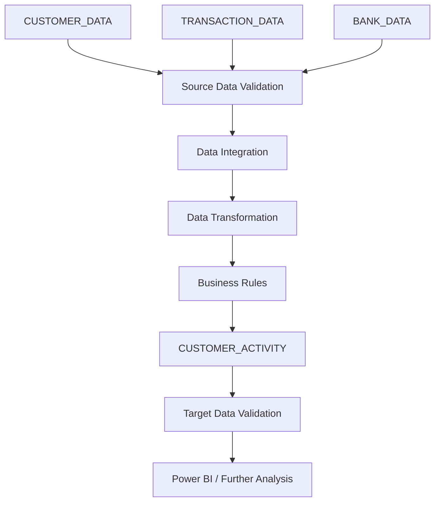
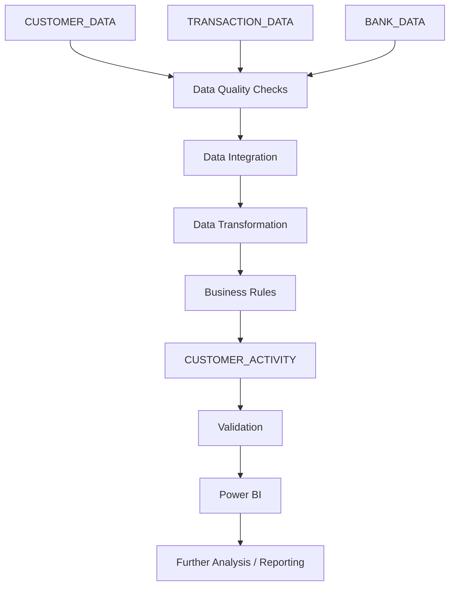

# Data Flow

This document describes the high-level flow of data within the Banking Customer Activity Analysis solution.

The purpose of the Data Flow is to show how data moves from source datasets through validation and transformation to the target analytical dataset and reporting layer.

---

<details>
<summary><strong>1. Data Flow Purpose</strong></summary>

Data Flow provides a high-level view of how data moves through the analytical solution.

It helps to:

- understand the overall movement of data
- identify the main processing stages
- understand relationships between source data and the target dataset
- support communication between business and technical stakeholders
- provide a basis for more detailed Data Lineage documentation

Data Flow focuses on the movement of data between major components rather than individual fields.

</details>

---

<details>
<summary><strong>2. High-Level Data Flow</strong></summary>

The overall data flow for the project is:

The following diagram was created using Mermaid and is rendered directly in GitHub Markdown.



This diagram shows the main stages through which data moves from source datasets to the final analytical and reporting layer.

</details>

---

<details>
<summary><strong>3. Source Data Layer</strong></summary>

The analytical solution uses three main source datasets:

| Source | Main Purpose |
|---|---|
| `CUSTOMER_DATA` | Provides the customer population and customer attributes |
| `TRANSACTION_DATA` | Provides customer transaction activity |
| `BANK_DATA` | Provides branch and regional context |

The source datasets remain unchanged during the analytical process.

Source access is assumed to be read-only.

</details>

---

<details>
<summary><strong>4. Data Validation Layer</strong></summary>

Before data is used for analytical processing, relevant quality checks are performed.

The validation stage includes:

- checking required fields
- identifying missing values
- checking key fields
- identifying potential duplicates
- validating relationships between datasets
- checking relevant data types and formats

The purpose of this stage is to identify issues that may affect analytical results.

</details>

---

<details>
<summary><strong>5. Data Integration</strong></summary>

The source datasets are connected using the defined relationships.

### Customer to Transaction

```text
CUSTOMER_DATA.CUSTOMER_ID
              ↓
TRANSACTION_DATA.CUSTOMER_ID
```

### Customer to Branch

```text
CUSTOMER_DATA.BRANCH_ID
              ↓
BANK_DATA.BRANCH_ID
```

The customer dataset provides the base population for the customer-level analytical output.

Transaction and branch information is added where required by the analytical use case.

</details>

---

<details>
<summary><strong>6. Transformation and Business Logic</strong></summary>

After integration, the data is transformed into the required analytical structure.

The main transformation activities include:

- applying the selected analysis period
- aggregating transactions by customer
- calculating transaction count
- calculating total transaction amount
- calculating average transaction amount
- identifying the latest transaction date
- determining customer activity status
- handling missing customer types
- preserving customers without transactions
- applying duplicate transaction rules

Business logic is defined separately in the Business Rules documentation.

</details>

---

<details>
<summary><strong>7. Target Analytical Dataset</strong></summary>

The main output of the data flow is the `CUSTOMER_ACTIVITY` analytical dataset.

The target dataset is designed at customer level.

```text
Source Data
     ↓
Integration
     ↓
Transformation
     ↓
Business Rules
     ↓
CUSTOMER_ACTIVITY
```

The target dataset contains customer attributes together with calculated customer activity metrics.

The detailed target structure is defined in the Data Modelling documentation.

</details>

---

<details>
<summary><strong>8. Validation of Target Data</strong></summary>

The target analytical dataset is validated before being used for reporting.

Validation includes:

- checking the target grain
- checking customer coverage
- validating calculated metrics
- checking business rule application
- checking consistency with source data
- validating expected customer activity results

The validation results support the reliability of the reporting dataset.

</details>

---

<details>
<summary><strong>9. Reporting Layer</strong></summary>

The validated target dataset is used as the basis for reporting and further analytical activities.

The main reporting tool used in this project is Power BI.

Potential reporting areas include:

- customer activity
- transaction volume
- transaction value
- active and inactive customers
- customer type analysis
- regional analysis
- time-based analysis

The reporting layer consumes the prepared analytical dataset.

</details>

---

<details>
<summary><strong>10. End-to-End Data Flow</strong></summary>

The complete high-level flow can be summarized as:

The following diagram was created using Mermaid and is rendered directly in GitHub Markdown.



This diagram represents the overall movement of data through the analytical solution.

</details>

---

<details>
<summary><strong>11. Data Flow Scope</strong></summary>

The Data Flow covers the movement of data from the identified source datasets to the final analytical and reporting layer.

It does not describe:

- individual field-level transformations in full detail
- technical implementation of production pipelines
- internal database engine processes
- infrastructure-level architecture

These details are outside the scope of this high-level Data Flow documentation.

</details>

---

### Related Diagram

A more detailed graphical Data Flow diagram has been created in diagrams.net and stored with the project documentation.

- [Data Flow Diagram XML](./data_flow_diagram.drawio)
- [Data Flow Diagram PNG](./data_flow_diagram.png)

---

## Related Documentation

- [Requirements](../../B_Business_Analysis/01_Requirements/requirements.md)
- [Data Sourcing & Data Understanding](../../B_Business_Analysis/04_Sources_Data_Understanding/sources_data_understanding.md)
- [Data Quality](../../B_Business_Analysis/05_Data_Quality/data_quality.md)
- [Business Rules](../../B_Business_Analysis/03_Business_Rules/business_rules.md)
- [Solution Design](../../B_Business_Analysis/10_Solution_Design/solution_design.md)
- [Target Solution](../../B_Business_Analysis/11_Target_Solution/target_solution.md)
- [Data Mapping](../01_Data_Mapping/data_mapping.md)
- [Data Modelling](../02_Data_Modelling/data_modelling.md)
- [Data Lineage](./data_lineage.md)
