# Data Lineage

This document describes the detailed lineage of data used in the Banking Customer Activity Analysis solution.

The purpose of Data Lineage is to show where data originates, how it is transformed, and how source attributes contribute to the final analytical output.

Data Lineage provides a more detailed view than the high-level Data Flow.

---

<details>
<summary><strong>1. Data Lineage Purpose</strong></summary>

Data Lineage provides traceability from source data to the final analytical output.

It helps to answer questions such as:

- Where did this data come from?
- Which source field was used?
- How was the value transformed?
- Which business rule was applied?
- Which target field or metric was created?
- Where is the final value used?

Data Lineage supports:

- traceability
- validation
- troubleshooting
- impact analysis
- transparency
- maintainability

</details>

---

<details>
<summary><strong>2. Lineage Scope</strong></summary>

The lineage covers the main path from:

```text
Source Attribute
      ↓
Join / Filter / Transformation
      ↓
Business Logic
      ↓
Target Attribute
      ↓
Reporting
```

The focus is on the data elements that are important for customer activity analysis.

</details>

---

<details>
<summary><strong>3. Customer Identifier Lineage</strong></summary>

The customer identifier originates from `CUSTOMER_DATA`.

The following diagram was created using Mermaid and is rendered directly in GitHub Markdown.

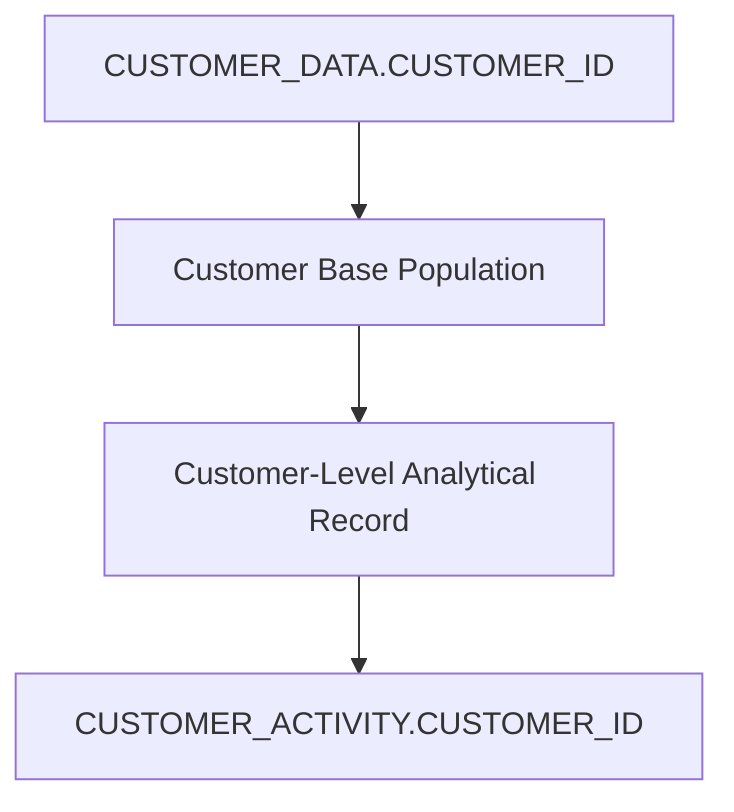

`CUSTOMER_ID` is also used to associate customer records with transaction data.

The identifier remains unchanged during the main analytical transformation.

</details>

---

<details>
<summary><strong>4. Transaction Count Lineage</strong></summary>

The `TRANSACTION_COUNT` metric is derived from transaction records.

The following diagram was created using Mermaid and is rendered directly in GitHub Markdown.

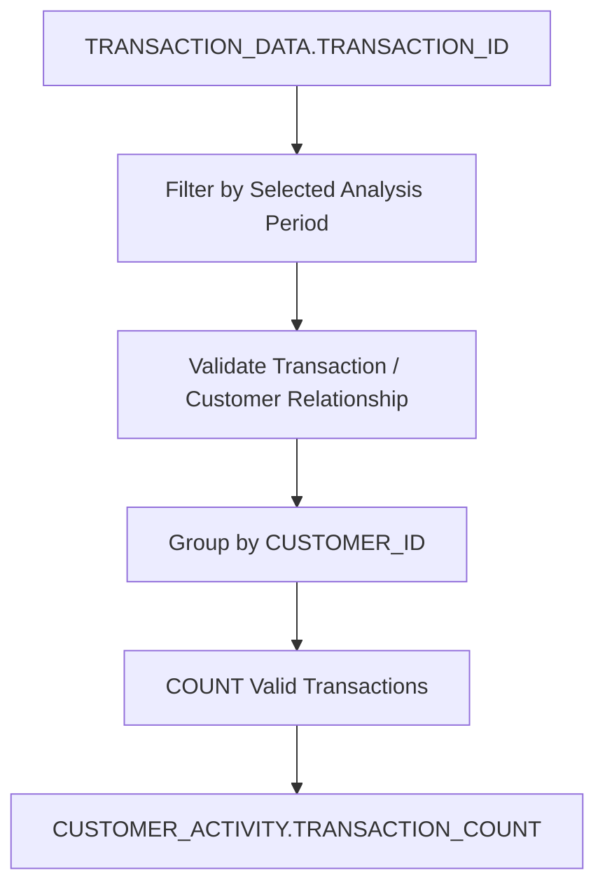

The metric is calculated using valid transactions associated with each customer.

Customers without transactions receive:

`TRANSACTION_COUNT = 0`

This follows the defined Business Rules.

</details>

---

<details>
<summary><strong>5. Total Transaction Amount Lineage</strong></summary>

The `TOTAL_TRANSACTION_AMOUNT` metric is derived from `TRANSACTION_AMOUNT`.

The following diagram was created using Mermaid and is rendered directly in GitHub Markdown.

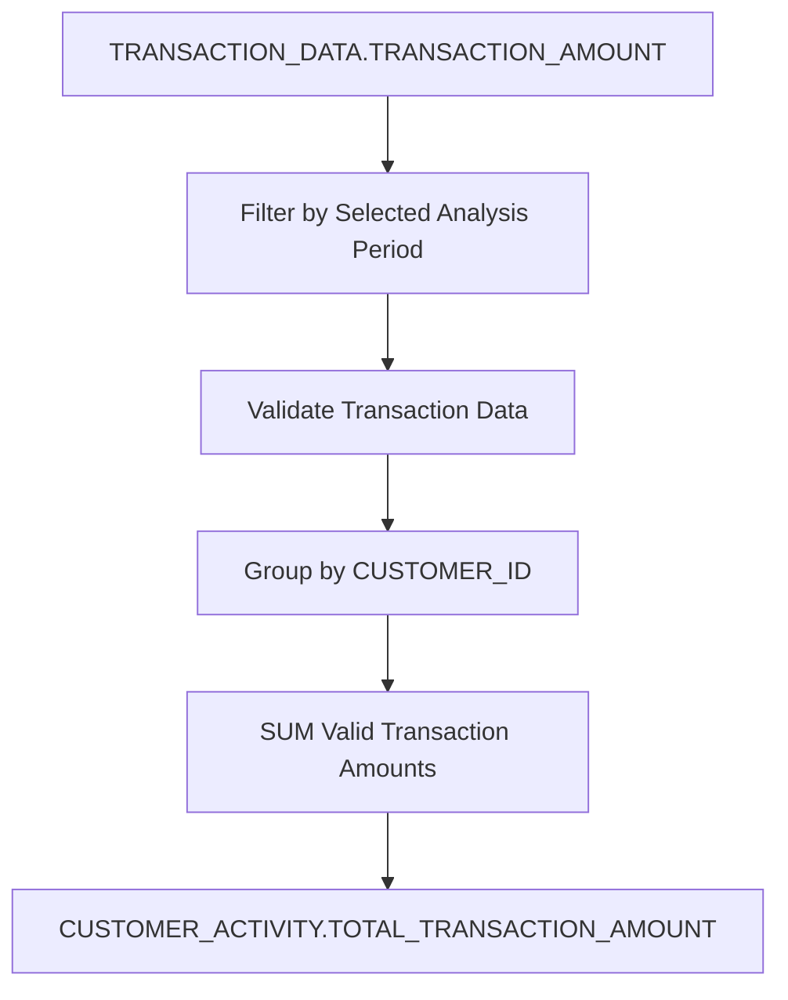

Customers without transactions receive:

`TOTAL_TRANSACTION_AMOUNT = 0`

</details>

---

<details>
<summary><strong>6. Average Transaction Amount Lineage</strong></summary>

The `AVG_TRANSACTION_AMOUNT` metric is derived from valid transaction amounts.

The following diagram was created using Mermaid and is rendered directly in GitHub Markdown.

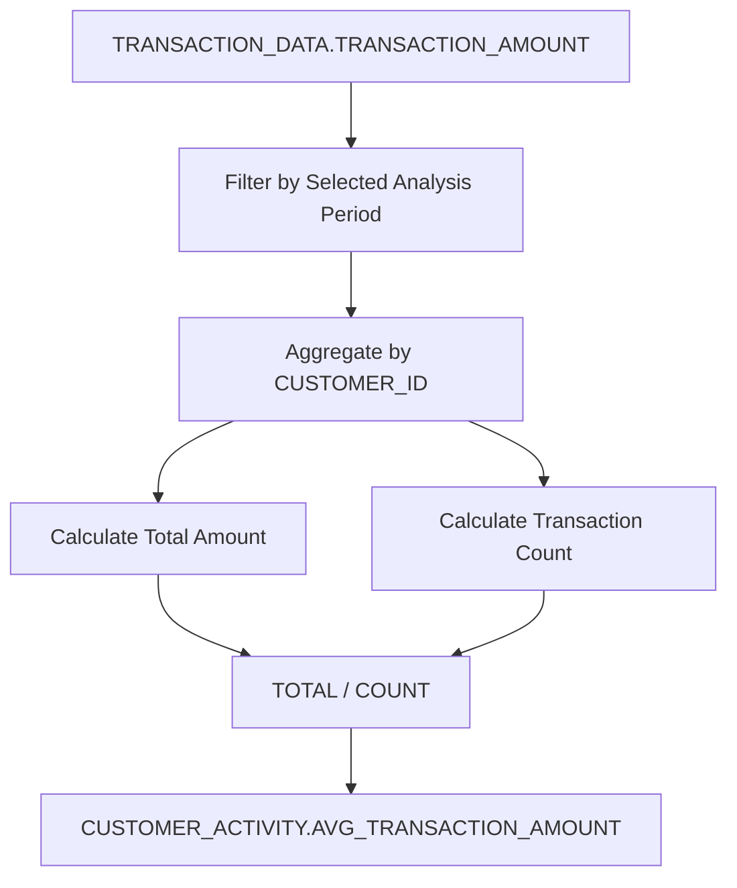

When a customer has no transactions during the selected period:

`AVG_TRANSACTION_AMOUNT = NULL`

</details>

---

<details>
<summary><strong>7. Last Transaction Date Lineage</strong></summary>

The `LAST_TRANSACTION_DATE` metric is derived from transaction dates.

The following diagram was created using Mermaid and is rendered directly in GitHub Markdown.

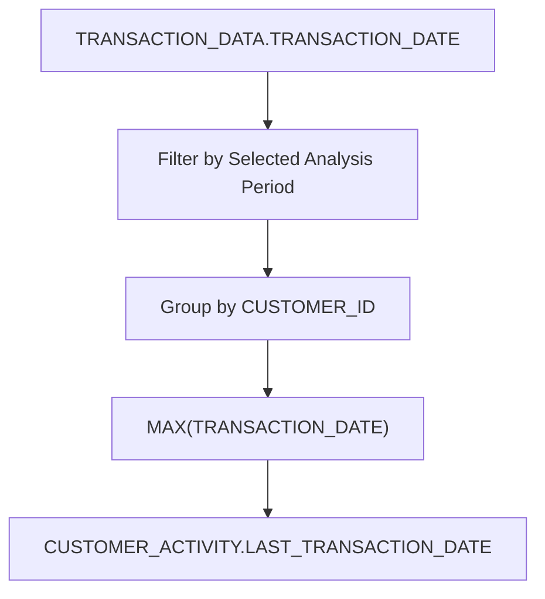

Customers without transactions during the selected period receive:

`LAST_TRANSACTION_DATE = NULL`

</details>

---

<details>
<summary><strong>8. Activity Status Lineage</strong></summary>

`ACTIVITY_STATUS` is a derived business classification.

The following diagram was created using Mermaid and is rendered directly in GitHub Markdown.

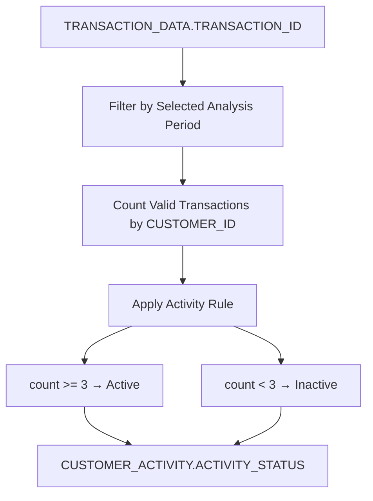

The activity classification is based on the Business Rule:

> A customer is Active when they have at least 3 valid transactions during the selected analysis period.

</details>

---

<details>
<summary><strong>9. Customer Type Lineage</strong></summary>

The customer type originates from `CUSTOMER_DATA`.

The following diagram was created using Mermaid and is rendered directly in GitHub Markdown.

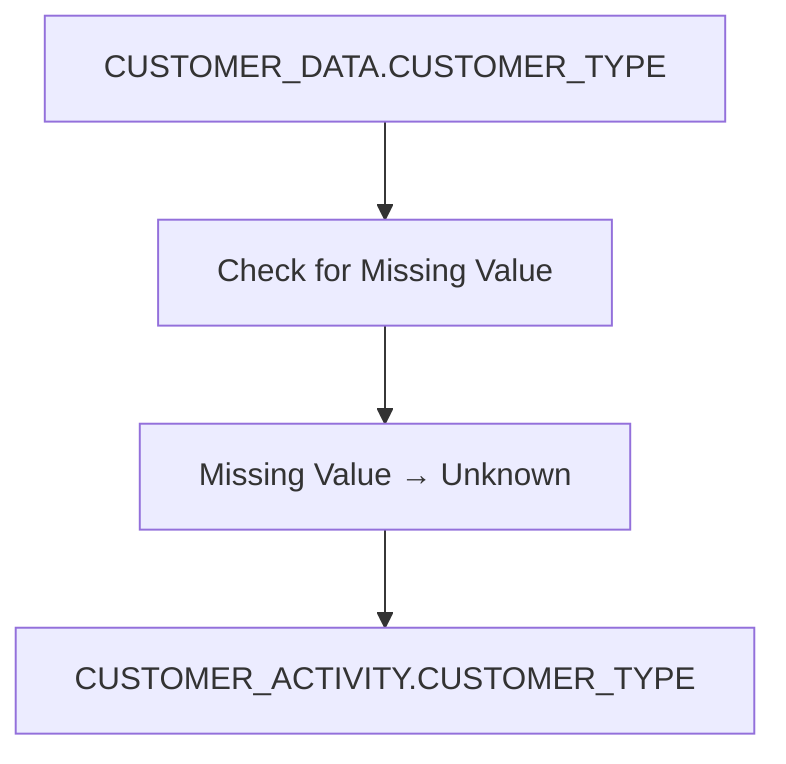

A missing customer type does not exclude the customer from the analytical dataset.

</details>

---

<details>
<summary><strong>10. Regional Attribute Lineage</strong></summary>

Regional information can be derived from customer and branch-related data.

### Customer Region

The following diagram was created using Mermaid and is rendered directly in GitHub Markdown.

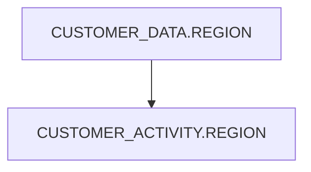

### Branch Information

The following diagram was created using Mermaid and is rendered directly in GitHub Markdown.

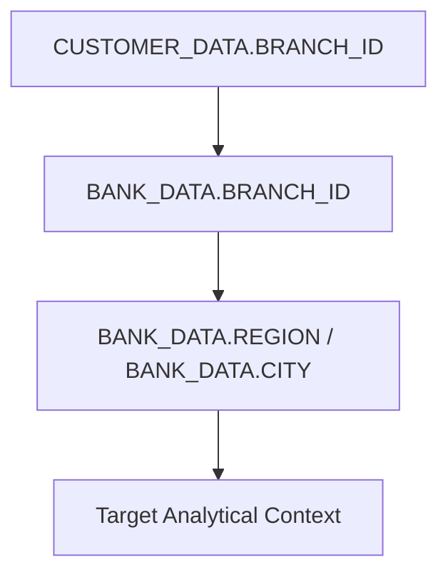

The exact use of branch-level attributes depends on the analytical requirement and final target model.

</details>

---

<details>
<summary><strong>11. Customer Coverage Lineage</strong></summary>

The target dataset is based on the full customer population.

The following diagram was created using Mermaid and is rendered directly in GitHub Markdown.

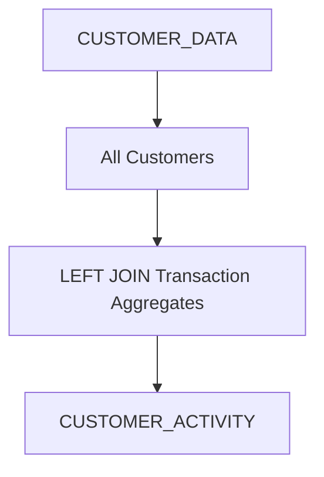

This design preserves customers who do not have transactions during the selected analysis period.

For customers without transactions, the relevant metrics are populated according to the Business Rules.

</details>

---

<details>
<summary><strong>12. Duplicate Handling Lineage</strong></summary>

Potential duplicate transactions are identified during data quality validation.

The following diagram was created using Mermaid and is rendered directly in GitHub Markdown.

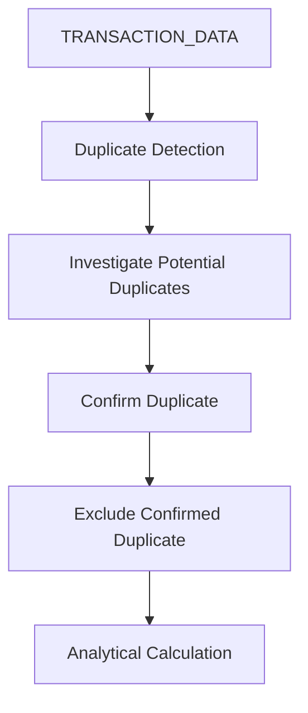

Confirmed duplicate transactions must not inflate customer activity metrics.

Potential duplicates should be investigated before being excluded.

</details>

---

<details>
<summary><strong>13. End-to-End Example</strong></summary>

The following example shows the lineage of a calculated customer metric.

The following diagram was created using Mermaid and is rendered directly in GitHub Markdown.

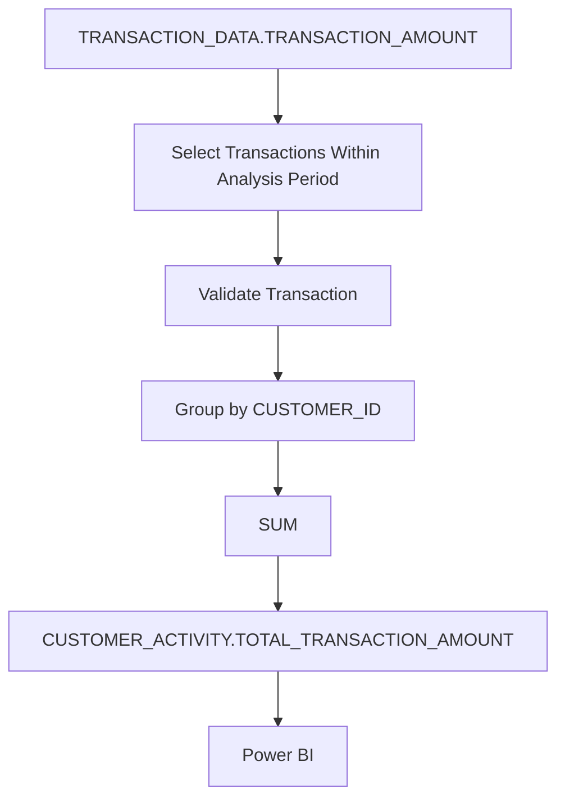

This provides traceability from the original source field to the final reporting output.

</details>

---

<details>
<summary><strong>14. Lineage and Traceability</strong></summary>

The documented lineage allows the analytical output to be traced back to:

- source dataset
- source attribute
- relationship or join
- filtering logic
- transformation
- aggregation
- business rule
- target attribute
- reporting usage

This supports validation and makes it easier to investigate changes or unexpected analytical results.

</details>

---

<details>
<summary><strong>15. Lineage Summary</strong></summary>

The main lineage paths can be summarized as:

The following diagram was created using Mermaid and is rendered directly in GitHub Markdown.

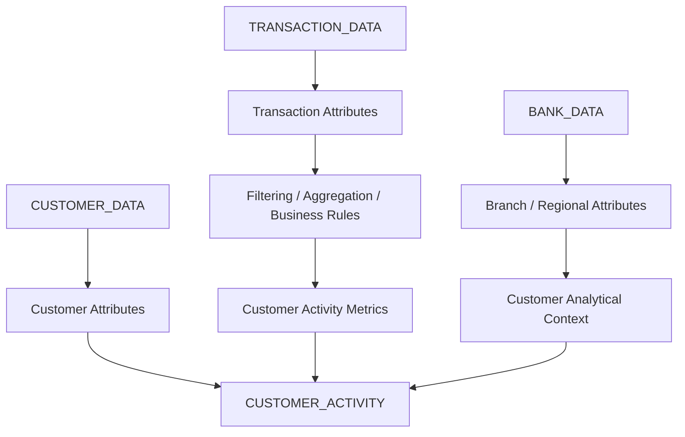

The detailed lineage provides the traceability required to understand how source data contributes to the final analytical dataset.

</details>

---

### Related Diagram

A more detailed graphical Data Lineage diagram may be created in diagrams.net and stored with the project documentation.

- [Data Lineage Diagram XML](./data_lineage_diagram.drawio)
- [Data Lineage Diagram PNG](./data_lineage_diagram.png)

---

## Related Documentation

- [Requirements](../../B_Business_Analysis/01_Requirements/requirements.md)
- [Business Rules](../../B_Business_Analysis/03_Business_Rules/business_rules.md)
- [Data Sourcing & Data Understanding](../../B_Business_Analysis/04_Sources_Data_Understanding/sources_data_understanding.md)
- [Data Quality](../../B_Business_Analysis/05_Data_Quality/data_quality.md)
- [Data Mapping](../01_Data_Mapping/data_mapping.md)
- [Data Modelling](../02_Data_Modelling/data_modelling.md)
- [Data Flow](./data_flow.md)
- [Solution Design](../../B_Business_Analysis/10_Solution_Design/solution_design.md)
- [Target Solution](../../B_Business_Analysis/11_Target_Solution/target_solution.md)
